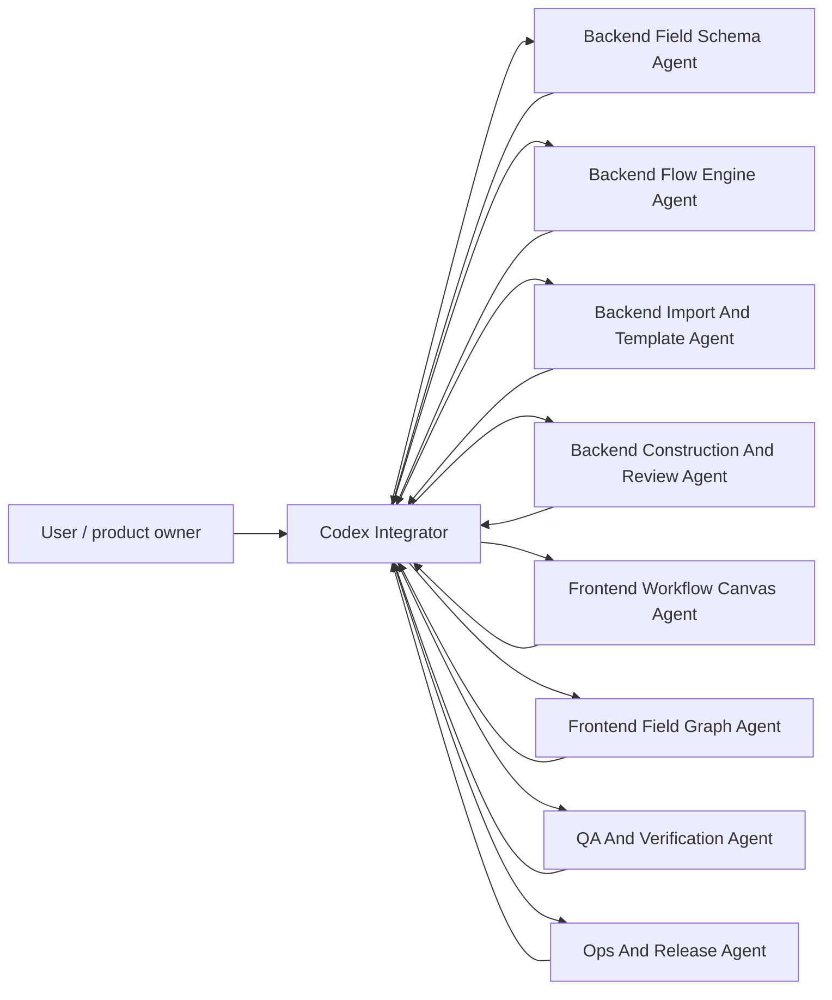
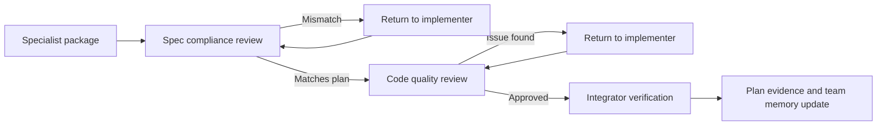

# PM Platform Team Development Operating Model

Last updated: 2026-07-02

This document records the standing team model for the operations engineering platform work. It is a context recovery file: every future Codex session or delegated agent should be able to read it and continue without relying on chat history.

## Chinese Context Anchor

本文件是“运维工程管理平台”团队开发的上下文锚点。后续如果 Codex 上下文变长、压缩、换线程或拆给多个智能体，先读本文件，再按这里的角色和节奏继续。

当前用户确认的产品方向：

- 平台不只服务“更换模块”一个项目，后续要能同步管理更换终端、台区线损排查等不同运维工程项目。
- 每个项目允许有独特字段，但必须围绕一个主字段、一个聚合字段和若干子字段建模。
- 字段要区分“初始建单可导入字段”和“现场施工采集字段”，并明确格式、扫码、拍照、手工录入等采集方式。
- 平台必须保留 KPI 必备字段，例如安装人员、安装时间、完成时间、在线时长、上传时间、照片数量、旧设备回收等。
- 项目流程要可视化、可拖拽、可按项目启用/停用模块，因为不同项目不一定走完全相同流程。
- 团队开发采用“一个总集成者 + 多个专项智能体”的方式；专项智能体可以拆包开发，但最终由 Codex Integrator 汇总、审阅、验证和交付。

## Mission

Build the existing module-manager project into a configurable operations engineering management platform. The platform must keep following the production line, while platform work stays isolated from production releases until reviewed and merged through the normal path.

The near-term product direction is:

- Project progress visibility.
- Project delivery capability and KPI measurement.
- Synchronized field construction data collection.
- Review, return, exception handling, and delivery archive.
- Configurable project templates, field schemas, import templates, and project workflows.

## Production Baseline Rules

- Default upstream repository: `https://github.com/yuechen202099-hub/module-manager-v3`.
- Platform development starts from the latest production branch, currently `production/V3/3.0.71`.
- Feature branches use `pm-platform/<short-feature>`.
- Do not commit directly to any `production/*` branch.
- Do not change official production version numbers.
- Do not create tags.
- Do not publish to the production server.
- Do not submit `.env`, secrets, real data, upload images, database dumps, or build archives.
- Do not overwrite production `.env`, `data`, `uploads`, OSS objects, or PostgreSQL data.
- Any change touching project configuration, permissions, database schema, import/export, or core business rules must include migration notes and rollback notes.

## Team Roles

### Team Topology

The team is organized as a hub-and-spoke delivery model. Specialist agents may implement isolated work packages, but the Codex Integrator remains the single owner of sequencing, shared-file edits, review, verification, and user-facing handoff.



### Standing Team Setting

固定团队设定如下，后续上下文压缩、换线程或拆给多个智能体时按此执行：

- `Codex Integrator` 是唯一总集成者，负责拆包、排期、共享文件串行化、最终审阅、验证和交付说明。
- 后端拆成三个常驻方向：字段模型、导入模板、施工审阅；涉及同一共享文件时必须由总集成者合并。
- 前端拆成两个常驻方向：流程画布、字段关系图；面向用户的改动必须做浏览器冒烟。
- `QA And Verification Agent` 每包都要补守卫或测试，并记录命令结果。
- `Ops And Release Agent` 负责生产基线、敏感路径、迁移/回滚说明，不负责直接发布生产。
- 当前节奏是“一次只完成一个可验证小包”：计划 -> 守卫红绿 -> 实现 -> 构建/浏览器验证 -> 文档归档 -> 再进入下一包。

### Codex Integrator

The current main Codex agent is the project manager, architect, reviewer, and integrator.

Responsibilities:

- Keep the branch aligned with the latest production baseline.
- Split work into isolated packages with clear file ownership.
- Prevent two agents from editing the same files at the same time.
- Review all code before integration.
- Run verification and record results.
- Maintain migration, rollback, and release-risk notes.
- Keep documentation updated so context survives long sessions.

### Backend Field Schema Agent

Owns configurable project fields.

Responsibilities:

- Primary field, aggregate field, child fields, required platform fields, and capture rules.
- Field data types and capture methods such as scan, photo, manual input, time, user, and select.
- Compatibility between imported work orders, completed external data, and field collection data.
- Field hierarchy rules used by the future graphical field designer.

Typical owned files:

- `v2-api/app/services/platform/*field*`
- `v2-api/app/services/platform/*template*`
- backend tests for schema, import, and project creation behavior
- verification scripts related to field schema configuration

### Backend Flow Engine Agent

Owns configurable project workflow definitions.

Responsibilities:

- Workflow nodes, edges, enabled modules, statuses, and transition rules.
- Per-project differences in process order and optional functions.
- API for reading and saving project workflow configuration.
- Compatibility with existing project modules and dashboard status cards.

Typical owned files:

- `v2-api/app/services/platform/workflow.py`
- project API route files that expose workflow endpoints
- backend tests for workflow defaults and round-trip saves

### Backend Import And Template Agent

Owns import and template onboarding.

Responsibilities:

- Initial project import templates.
- Mid-project takeover templates for already-running projects.
- Completed external-data import behavior, where platform-owned fields are filled at upload time when missing.
- Validation reports that are useful to non-technical operators.

Typical owned files:

- platform template services
- import task services
- import verification scripts and tests

### Backend Construction And Review Agent

Owns field execution and review loops.

Responsibilities:

- Construction collection payloads.
- Required evidence such as installer, install time, online time, photos, old-device recovery, and operator identity.
- Review pass, reject, rework, exception, and archive states.
- KPI source data needed for efficiency, quality, and delivery dashboards.

Typical owned files:

- construction APIs
- review APIs
- backend status aggregation and KPI tests

### Frontend Workflow Canvas Agent

Owns the draggable visual workflow editor.

Responsibilities:

- Node palette.
- Draggable workflow lane or canvas.
- Connection preview between steps.
- Node configuration panel.
- Enable, disable, reorder, and save workflow behavior.
- Non-technical operator language.

Typical owned files:

- `v2-web/src/components/project-workflow/*`
- project configuration views that open workflow editing
- frontend API client additions for workflow endpoints

### Frontend Field Graph Agent

Owns the graphical field configuration experience.

Responsibilities:

- Drag-and-drop field hierarchy editing.
- Main field, aggregate field, and child field relationships.
- Capture method and data type controls.
- Template preview and required field warnings.

Typical owned files:

- project field configuration components
- `v2-web/src/views/ProjectsView.vue` only when coordinated by Codex Integrator

### QA And Verification Agent

Owns repeatable verification.

Responsibilities:

- Focused backend tests.
- Frontend build checks.
- Guard scripts that catch accidental regressions.
- Browser verification for visible user flows.
- Sensitive path and dirty-state checks before handoff.

Typical owned files:

- `scripts/verify_*`
- focused backend/frontend tests
- documentation of test commands and observed results

### Ops And Release Agent

Owns release readiness and operational safety.

Responsibilities:

- Baseline commit tracking.
- Rebase or merge strategy against latest production line.
- Backup, validation, and rollback notes.
- Production safety checklist.
- PR handoff summary.

Typical owned files:

- release notes, SOP notes, and handoff reports
- no production deployment files unless explicitly approved

## Work Package Contract

Every delegated task must include:

- Objective.
- Production baseline and feature branch.
- Files the agent may edit.
- Files the agent must not edit.
- Data safety constraints.
- Expected tests or verification commands.
- Output format: changed files, behavior summary, test result, risks, rollback notes.

Agents should not make broad refactors. They should make the smallest useful change that advances the current platform milestone.

## Delegation And Merge Rules

Use these rules whenever the project is split across multiple agents:

- One package, one owner. A package has a named lead role and a bounded file list.
- Shared files are serialized by the Codex Integrator. No specialist agent should independently edit shared integration files without an explicit handoff.
- Backend packages should expose stable data contracts before frontend packages consume them.
- Frontend packages should add guard scripts when the behavior is mostly visual or structural.
- Every package must leave a plan or report file under `docs/superpowers/plans/` when it changes platform behavior.
- Every package must report verification evidence, not only a narrative summary.
- If the production baseline advances, the Ops And Release Agent first checks the new branch and the Codex Integrator rebases or merges before more feature work continues.

Current integration hotspots:

- `v2-api/app/api/routes/projects.py`
- `v2-api/app/services/platform/catalog.py`
- `v2-api/app/services/platform/templates.py`
- `v2-web/src/api/types.ts`
- `v2-web/src/api/services.ts`
- `v2-web/src/views/ProjectsView.vue`
- `v2-web/src/views/ProjectBoardView.vue`
- `v2-web/src/views/ConstructionView.vue`
- `v2-web/src/views/ReviewView.vue`

## Standing Execution Rhythm

Use this rhythm when the platform work continues across long Codex contexts or multiple agents:

1. Read `AGENTS.md`, `docs/AGENT_REQUIRED_READING.md`, `docs/sop/README.md`, this document, and the active plan under `docs/superpowers/plans/`.
2. Confirm the current production baseline branch and local feature branch before editing code.
3. Prefer `codebase-memory-mcp` for code discovery. If the graph is stale or shallow, fall back to direct file reads and focused local tests.
4. Keep one main Codex Integrator responsible for sequencing, integration, review, and final reporting.
5. Split implementation into small packages that can be tested independently.
6. Use test-first work for backend behavior and guard scripts for frontend structure.
7. After each package, record changed files, verification commands, risk, and rollback notes.
8. Before handoff, check sensitive paths and generated assets separately.

## Team Execution Cadence

Use this cadence for every platform package:

1. Codex Integrator turns the user request into one small work package.
2. The package names a lead role, file boundary, verification command, migration note, rollback note, and UI acceptance signal.
3. Backend contract work is completed before frontend consumption, unless the work is only visual copy or layout.
4. Frontend visual work gets a guard script when browser-only verification would be too fragile.
5. Browser smoke checks are required when the user-facing screen changes.
6. Shared integration files are edited serially by Codex Integrator.
7. Completed package results are written into the active plan and this operating model when they change team rhythm or product sequencing.

## Minimum Acceptance Gate

No package is accepted from narrative alone. A completed package must record:

- changed files,
- the owner role and file boundary,
- at least one focused test, guard script, build, browser smoke, or API verification result,
- a non-technical UI acceptance signal when the screen changes,
- migration notes and rollback notes for configuration, permissions, database, import/export, or core business rule changes,
- sensitive path status for `.env`, `data`, `v2-api/data`, `v2-api/app/static/uploads`, and `uploads`, plus a live OSS/PostgreSQL change-path guard.

## Context-Stable Team Contract

This section is the authoritative team setting when context is compacted, a new thread takes over, or the work is split across multiple intelligent agents.

- Codex Integrator remains the single project manager and final integrator. Specialist agents may implement bounded packages, but the integrator owns sequencing, shared-file edits, review, verification, and the user-facing handoff.
- Backend work is split into four lanes: Field Schema, Flow Engine, Import And Template, and Construction And Review. These lanes should not edit the same shared backend contract files in parallel.
- Frontend work is split into three lanes: Workflow Canvas, Field Graph, and Operator Workbench UI. User-facing frontend work must include a visible acceptance signal and browser smoke validation.
- QA And Verification owns guard scripts, focused tests, builds, browser checks, and sensitive-path checks. No package is accepted from narrative alone.
- Ops And Release owns production baseline tracking, branch discipline, migration notes, rollback notes, and PR or patch packaging. It must not publish, tag, bump official version numbers, or touch production data without explicit user approval.
- Each package uses the same rhythm: plan -> failing guard or focused test -> implementation -> build/browser/API verification -> plan evidence -> team memory update.
- If production advances to a newer `production/V3/<version>` branch, feature work pauses until the baseline is checked and the platform branch is merged or rebased in a controlled way.
- Shared hotspots are serialized by Codex Integrator: `v2-api/app/api/routes/projects.py`, `v2-api/app/services/platform/templates.py`, `v2-api/app/services/platform/catalog.py`, `v2-web/src/api/types.ts`, `v2-web/src/api/services.ts`, `v2-web/src/views/ProjectsView.vue`, `v2-web/src/views/ConstructionView.vue`, and generated Vue static assets.
- Production safety shorthand for this platform stream: no tag, no deploy, no official version bump, no production data edit, and no production OSS/PostgreSQL write without explicit user approval.

### Agent Dispatch Packet Template

Every subagent package must be dispatched with this fixed packet. If a future context is compacted, rebuild the packet from this section before asking another worker to implement anything.

```text
Package:
Owner role:
Objective:
Production baseline:
Feature branch:
Allowed files:
Forbidden files:
Shared-file coordination:
Data safety constraints:
Expected verification:
Migration note:
Rollback note:
UI acceptance signal:
Output required:
```

Required meanings:

- `Owner role` must be one of the standing roles in this document, such as Backend Field Schema Agent, Backend Flow Engine Agent, Backend Import And Template Agent, Backend Construction And Review Agent, Frontend Workflow Canvas Agent, Frontend Field Graph Agent, QA And Verification Agent, Ops And Release Agent, or Codex Integrator.
- `Allowed files` must be narrow. Shared hotspots stay with Codex Integrator unless the packet explicitly grants a specialist edit.
- `Forbidden files` must include `.env`, real data, uploads, database dumps, secrets, production release artifacts, and any production OSS/PostgreSQL write path unless the user separately approves the risky action.
- `Expected verification` must name concrete commands or browser/API checks.
- `Migration note` and `Rollback note` are required when touching project configuration, permissions, database schema, import/export, or core business rules.
- `Output required` must include changed files, behavior summary, verification result, risks, rollback notes, and unresolved questions.

### Two-Stage Review Gate

No specialist package is accepted only because the implementer says it is done. Codex Integrator owns the review loop and must apply both gates before the package becomes part of the handoff.



- Spec compliance review checks that the package matches the user request, the active plan, the product direction, and the agreed file boundary.
- Code quality review checks maintainability, compatibility with existing replacement-project behavior, data safety, verification evidence, and rollback clarity.
- If either review finds an issue, the package returns to the same package owner or a focused fixer before any next package starts.
- QA And Verification Agent may review guard scripts and command results, but Codex Integrator remains accountable for final acceptance.

### Backend Team Split Contract

Backend work is split to reduce context load and prevent one worker from owning too much logic at once.

- Backend Field Schema Agent owns primary field, aggregate field, child fields, field source, capture method, required KPI field alignment, and field hierarchy contracts.
- Backend Flow Engine Agent owns workflow nodes, module toggles, status transitions, workflow persistence contracts, and project-readiness flow checks.
- Backend Import And Template Agent owns initial work-order templates, external-completed takeover templates, validation, import execution, and platform-owned field defaults at upload time.
- Backend Construction And Review Agent owns construction payloads, site evidence, installer/time/online/KPI fields, review status, rework, exception, archive, and delivery-quality summaries.
- Shared backend files are serialized by Codex Integrator, especially project routes, shared platform catalog/template services, and contract snapshots.
- No production database migration may start without explicit user approval.

### Frontend Team Split Contract

Frontend work is split by user workflow rather than by technical file alone.

- Frontend Workflow Canvas Agent owns visual workflow editing, module switches, node order, enabled/disabled functions, and workflow acceptance signals.
- Frontend Field Graph Agent owns draggable field hierarchy, main/aggregate/child relationships, capture controls, template actions, and schema warnings.
- Operator Workbench UI Agent owns project list, project cockpit, construction page, review workbench, and non-technical copy that operators see daily.
- Frontend UI packages that change visible behavior require a browser smoke result or a guard script that proves the expected visible tokens and interactions.
- Shared files such as `ProjectsView.vue`, API service/type files, generated Vue assets, and page-level routing remain integration hotspots controlled by Codex Integrator.

### Next Execution Queue

Continue in this order unless the user reprioritizes:

1. Keep the PR/patch handoff ready and refresh its evidence when new packages are added.
2. Platform Handoff Readiness Summary is now the current review entry: `GET /projects/handoff/readiness` and `/platform-projects` show `交付就绪`, `可评审包`, `production/V3/3.0.71`, and `生产迁移未放行`.
3. Before new implementation work, refresh the production baseline branch and confirm the platform branch still follows `production/V3/3.0.71` or the newest user-approved production branch.
4. If the user chooses PR, use the prepared PR body and target the current production branch without version bump, tag, or deployment.
5. If the user chooses patch, export a reviewable patch against the same production baseline and include the handoff report.
6. If the user explicitly approves persistence migration, create the first Alembic/PostgreSQL migration as a separate high-risk package with backup, dry-run, verification, and rollback rehearsal.
7. After a migration package exists, add persistence-backed contract tests before enabling production reads from PostgreSQL.

## Team Memory Snapshot

This section is the short version for context recovery. If a future thread is compacted, read this before continuing development.

- Current production baseline: `production/V3/3.0.71`.
- Current feature branch: `pm-platform/project-drafts`.
- GitHub Issue #1 follow-up: production has advanced to `production/V3/3.0.77`, and the next platform PR/patch must include `平台版本号评估`.
- Platform versioning recommendation: use `PM-V1.0.xx` only as a platform development progress version, always paired with the production baseline, and never as a replacement for production `V3.0.xx`.
- Current platform direction: configurable operations engineering management, not a single replacement-module project.
- Current delivery style: small work packages, each with owner role, file boundary, verification, migration note, rollback note, and browser smoke when UI changes.
- Current integrator rule: specialist agents may work on isolated packages, but Codex Integrator owns shared files, final review, verification, and user handoff.
- Current data safety rule: no production `.env`, real data, uploads, OSS, PostgreSQL, version tag, release, or server publish changes.
- Current code discovery rule: use `codebase-memory-mcp` first; current graph is ready but shallow, so direct file reads and focused tests are allowed when symbol-level graph search is insufficient.
- Context compression rule: after any compaction or thread handoff, read this snapshot first, then the active plan; do not rely only on chat history.
- Current active package: keep PR/patch handoff notes current after Platform Handoff Readiness Summary, or wait for explicit approval before any Alembic/PostgreSQL migration.
- Last completed package: Platform LAN Tablet Access; `scripts/start-platform-local.ps1` now keeps `127.0.0.1` as the default local-only mode, supports explicit `-HostAddress 0.0.0.0` for trusted LAN tablet review, prints a `LAN URL`, and is guarded by `scripts/verify_platform_local_start_script.py`.
- Current GitHub action item: before final PR/patch, merge or rebase the platform branch onto `production/V3/3.0.77`, then refresh handoff reports, tests, baseline SHA, and the concrete `PM-V1.0.xx` progress label.
- Baseline sync readiness result: do not merge directly in the current dirty worktree. Production `3.0.77` changes 145 paths, current platform WIP has 192 dirty paths, and 43 paths overlap, including `projects.py`, frontend API files, `ProjectsView.vue`, and generated Vue assets.
- Previous completed package: Platform Handoff Readiness Summary; `GET /projects/handoff/readiness` aggregates readiness, persistence, migration gates, production safety, and next actions, while `/platform-projects` shows `交付就绪`, `可评审包`, `production/V3/3.0.71`, and `生产迁移未放行` before `上线检查`.
- Previous completed package: Platform Migration Readiness Gate; `/projects/persistence/migration-readiness` and the `持久化准备` panel now show backup, dry-run, verification, rollback, approval, and cutover-flag gates as blocked before any migration can proceed.
- Previous completed package: Project Persistence Readiness Frontend; `/platform-projects` field configuration now shows `持久化准备`, current storage, PostgreSQL migration approval state, target tables, round-trip preservation, and safety gates by consuming existing read-only persistence endpoints.
- Earlier completed package: Project readiness action filter; `/platform-projects` lets operators click a `接入待办` action count, shows `筛选中`, filters the table through `filteredProjects`, and restores the full list through `清除筛选`.
- Earlier completed package: Project readiness action todos; `/platform-projects` now consumes `GET /projects/readiness/summary` action counts and shows `接入待办` next to `上线状态` without adding row-level operation buttons.
- Earlier completed package: Project readiness summary list; `/platform-projects` consumes `GET /projects/readiness/summary` and shows `上线状态` for every project.
- Earlier completed package: Team Operating Model Lock; the multi-agent team setting, dispatch packet, two-stage review gate, backend/frontend split, and next execution queue are now guarded by `scripts/verify_pm_platform_team_operating_model.py`.
- Earlier completed package: frontend project readiness panel; `/platform-projects` field configuration consumes `GET /projects/{project_id}/readiness` and shows a visible `上线检查` result.
- Previous backend package: project readiness check; `GET /projects/{project_id}/readiness` tells whether a project has enough field schema, site evidence, KPI, module, and workflow configuration to be taken over or launched.

Current code discovery state:

- `codebase-memory-mcp` project: `C-Users-Yuech-Documents-module-manager-v3`.
- Current graph status: ready, but shallow file-level indexing only.
- Use graph tools first for architecture/file discovery, then fall back to direct file reads and focused local tests when symbol-level search is insufficient.

## Context Recovery Protocol

When a Codex context becomes long, compacted, or resumed by another worker, recover in this order:

1. Read the production guardrails: `AGENTS.md`, `docs/AGENT_REQUIRED_READING.md`, and `docs/sop/README.md`.
2. Read this file as the team operating model.
3. Check the local branch and baseline with Git before editing.
4. Use `codebase-memory-mcp` first for code discovery. If it only has shallow file-level indexing, record that and fall back to direct file reads.
5. Read the most recent plan files in `docs/superpowers/plans/` for the active milestone.
6. Run the smallest relevant guard or test before claiming a package is complete.
7. Update this file if the team shape, ownership rules, active package, or next package queue changes.

## Active Task Board

The current platform build should proceed in this order unless the user reprioritizes:

| Order | Work package | Lead role | Completion signal |
| --- | --- | --- | --- |
| 1 | Team operating model and context recovery | Codex Integrator | Done: this document records roles, rhythm, task board, and recovery rules |
| 2 | Workflow status summary for dashboards | Backend Flow Engine Agent | Done: project overview exposes workflow-aware current node and enabled modules |
| 3 | Workflow status display in project list | Frontend Workflow Canvas Agent | Done: non-technical users can see configured flow state from `/platform-projects` |
| 4 | Field graph designer plan | Backend Field Schema Agent + Frontend Field Graph Agent | Done: main field, aggregate field, child field, import field, and site-capture field rules have a design spec |
| 5 | Import template handoff | Backend Import And Template Agent | Done for current pass: initial and external-completed templates are explained, downloadable, validated, and guided through next actions |
| 6 | Construction and review loop | Backend Construction And Review Agent | In progress: KPI fields, site evidence, review, rework, exception, and archive states are connected; next pass links delivery KPI to review quality |
| 7 | Project cockpit KPI band | Frontend Workflow Canvas Agent + QA And Verification Agent | Done: `/project-board` shows platform operation-stage and delivery-capability KPI cards |
| 8 | Workflow module toggles | Frontend Workflow Canvas Agent + QA And Verification Agent | Done for current pass: workflow editor shows module switches, affected node counts, required-node counts, and keeps required nodes enabled |
| 9 | Field graph designer implementation | Frontend Field Graph Agent + Backend Field Schema Agent | Done for current pass: field configuration shows visual hierarchy, role buckets, drop zones, selected details, and drag/drop parent reassignment |
| 10 | Field graph to template contract alignment | Backend Import And Template Agent + Frontend Field Graph Agent | Done for current pass: field graph exposes initial/external template download and validation actions, and the construction checklist keeps platform KPI required fields visible |
| 11 | Construction checklist consumption and QA/PR handoff | Backend Construction And Review Agent + QA And Verification Agent + Ops And Release Agent | Done for current pass: construction-side collection consumes the configured checklist |
| 12 | Backend shared contract snapshot | Backend Field Schema Agent + Backend Import And Template Agent + Backend Construction And Review Agent + QA And Verification Agent | Done: `contracts.py` exposes template, field, construction, KPI, and review contract names with pytest and script guards |
| 13 | Platform persistence status | Backend Flow Engine Agent + Ops And Release Agent + QA And Verification Agent | Done: `/projects/persistence/status` exposes read-only storage/backend status with pytest and script guards |
| 14 | PostgreSQL persistence design | Backend Flow Engine Agent + Ops And Release Agent + QA And Verification Agent | Done: `postgres_design.py` defines the first schema/workflow persistence slice, indexes, migration steps, and rollback steps without touching the database |
| 15 | PR/patch handoff or user-approved Alembic migration | Codex Integrator + Ops And Release Agent | Done for handoff: report, PR body draft, package guard, focused verification, and production-safety notes are prepared; wait for user choice before PR, patch, or Alembic migration |
| 16 | Project config persistence contract preview | Backend Flow Engine Agent + QA And Verification Agent + Ops And Release Agent | Done for current pass: `GET /projects/{project_id}/persistence/contract` previews field schema/workflow persistence rows and round-trip readiness without a migration |
| 17 | Persistence contract in backend shared snapshot | Backend Flow Engine Agent + QA And Verification Agent | Done: `contracts.py` exposes `persistence.project_config` and guards route, table, record, round-trip, migration, and safety names |
| 18 | Project readiness check | Backend Flow Engine Agent + Backend Field Schema Agent + QA And Verification Agent | Done: `GET /projects/{project_id}/readiness` checks field schema, site evidence, KPI, module, and workflow readiness without writing data |
| 19 | Frontend project readiness panel | Frontend Field Graph Agent + Operator Workbench UI Agent + QA And Verification Agent | Done: field configuration dialog shows backend `上线检查`, readiness checks, next actions, and refresh behavior without adding more row-level operation buttons |
| 20 | Team Operating Model Lock | Codex Integrator + QA And Verification Agent | Done: team setting, subagent dispatch packet, two-stage review gate, backend/frontend split, next execution queue, and guard script are recorded |
| 21 | Project readiness summary list | Backend Flow Engine Agent + Operator Workbench UI Agent + QA And Verification Agent | Done: `GET /projects/readiness/summary` and `/platform-projects` `上线状态` column show scan-friendly multi-project readiness |
| 22 | Project readiness action todos | Backend Flow Engine Agent + Operator Workbench UI Agent + QA And Verification Agent | Done: readiness summary returns `action_counts` and `/platform-projects` shows `接入待办` action counts |
| 23 | Project readiness action filter | Operator Workbench UI Agent + QA And Verification Agent | Done: clicking a `接入待办` tag filters `/platform-projects`, shows `筛选中`, and `清除筛选` restores the full list |
| 24 | Project Persistence Readiness Frontend | Operator Workbench UI Agent + Ops And Release Agent + QA And Verification Agent | Done: field configuration shows `持久化准备`, storage backend, PostgreSQL approval state, target tables, round-trip status, and safety gates without running a migration |
| 25 | Platform Migration Readiness Gate | Backend Flow Engine Agent + Operator Workbench UI Agent + Ops And Release Agent + QA And Verification Agent | Done: read-only migration gate exposes backup, dry-run, verification, rollback, approval, and cutover-flag blockers before any PostgreSQL migration |
| 26 | Platform Handoff Readiness Summary | Codex Integrator + Operator Workbench UI Agent + Ops And Release Agent + QA And Verification Agent | Done: `/projects/handoff/readiness` and `/platform-projects` show `交付就绪`, `可评审包`, target baseline, migration block state, and PR/patch next action |
| 27 | Platform LAN Tablet Access | Ops And Release Agent + QA And Verification Agent | Done: local start script defaults to `127.0.0.1`, supports explicit `-HostAddress 0.0.0.0`, prints LAN URL, and verifies both local and LAN HTTP access |
| 28 | GitHub Issue #1 Platform Versioning Follow-up | Codex Integrator + Ops And Release Agent | In progress: PR/patch docs now include `平台版本号评估`; next required step is to follow `production/V3/3.0.77` before final handoff |
| 29 | Production 3.0.77 Sync Readiness | Codex Integrator + Ops And Release Agent + QA And Verification Agent | Done for readiness: drift, dirty overlap, merge-tree conflicts, and safe sync sequence are recorded; actual merge waits for WIP snapshot/isolation |

## Integration Checkpoints

Codex Integrator should pause for a review pass at these checkpoints:

- A workflow configuration change starts affecting project modules or dashboard status.
- A field schema change affects import/export, required fields, or construction capture.
- A database schema, permission rule, or core business rule change is proposed.
- A build regenerates Vue static assets.
- A task is ready for PR or patch packaging.

For low-risk UI and local API work, continue implementation after focused verification. For production data, deployment, database migration, OSS, or permission changes, ask the user before acting.

## Parallel Development Rules

- Agents may work in parallel only when their file ownership does not overlap.
- If two work packages need the same file, Codex Integrator serializes the work.
- `ProjectsView.vue`, project API route files, and shared platform catalog services are integration hotspots; edits there require coordination.
- Agents should prefer additive files and focused tests, then let Codex Integrator wire integration points.
- Generated Vue static assets may change after frontend builds; they must be reviewed as generated output, not manually edited.

## Review Gates

Before a work package is accepted:

- The implementation must match the product direction and not just expose abstract knobs.
- The UI must be understandable for a non-technical project operator.
- The backend must keep existing replacement-project behavior compatible.
- Tests or guard scripts must prove the new behavior.
- Migration and rollback notes must exist for risky changes.
- Sensitive paths must remain untracked.

## Current Workstream

The active milestone is configurable field schema plus import-template onboarding.

Reference plan:

- `docs/superpowers/plans/2026-07-01-pm-platform-flow-orchestrator-mvp.md`

The workflow editor MVP lets a user configure a project-specific process visually, because not every project needs every function and different project types have small process differences.

Initial workflow nodes:

- Project setup.
- Field schema configuration.
- Template import.
- Work order planning.
- Field construction collection.
- Review.
- Rework.
- Exception handling.
- Delivery archive.
- Delivery export.

The workflow editor should start practical and controlled: use a clear visual lane or canvas first, store a structured workflow definition, and expand into richer automation after the data model stabilizes.

Completed execution packages:

- Align field-graph template previews with the real backend template download and validation rules.
- The backend template service is the source of truth for initial work-order templates and external-completed takeover templates.
- The frontend field graph may keep a local fallback, but normal preview data should come from the backend preview API.
- This keeps downloadable Excel headers, validation expected headers, and visual configuration preview consistent.
- Connect external-completed takeover imports to the local platform work-order store.
- `initial_work_orders` means work still needs field construction; `external_completed` means the work already happened outside the platform and enters at the review stage.
- When external-completed import execution creates local work orders, platform-owned KPI fields are filled at execution time and the work orders are marked as submitted/pending review.
- Extend the review page into a platform review workbench entry with status filters, selected work-order details, field/photo evidence checks, review history, and approve/return/exception actions.
- Surface returned platform work orders in the construction page as actionable rework, with a returned-only filter and visible return reason.
- Split project-level platform KPIs into initial work orders, external completed takeover, pending review, returned rework, approved archive, and not-ready work.
- Promote the same platform KPI split into the project cockpit so operators can read operational stages from `/project-board?project_id=<project>`.
- Preserve required construction KPI fields on platform work orders: installer, install/completion/upload time, online duration, photo count, and old-device recovery status.
- Promote construction delivery KPI summaries into `/platform-projects` and `/project-board`, while keeping them visually separate from work-order flow stages.
- Explain import template choices and guided next actions in `/platform-projects`: `initial_work_orders` continues to construction collection, while `external_completed` continues to review and archive.
- Connect delivery KPI visibility with review quality: `/project-board` and `/platform-projects` now show approved archive, returned rework, pending review, pass rate, and return rate next to field evidence KPIs.
- Add module-level workflow toggles to the visual workflow editor: each project can enable or disable optional functional modules, see affected workflow nodes, and keep required nodes protected.
- Improve the field graph designer so project fields are configured through visible hierarchy drop zones, role buckets, selected-field details, and drag/drop parent reassignment.
- Connect field graph configuration to template actions and checklist guidance: field configuration now launches initial-work-order and external-completed template download/validation, and the construction checklist panel always keeps platform KPI fields visible.
- Connect construction-side collection to the configured checklist: `ConstructionView.vue` now derives site checklist items from configured construction fields, photo slots, and platform KPI fields, and shows them in both inline and drawer collection forms.
- Add a backend shared contract snapshot: `v2-api/app/services/platform/contracts.py` records template types, field schema names, construction payload keys, required KPI keys, review status keys, and review actions for future backend decomposition and PR/patch checks.
- Expose platform persistence status: `v2-api/app/services/platform/persistence.py` and `GET /projects/persistence/status` show current local JSON/file stores, redacted database URL, and safety guarantees without writing data.
- Add PostgreSQL persistence design: `v2-api/app/services/platform/postgres_design.py` describes `platform_project_configs` and `platform_project_config_events`, including indexes, migration notes, rollback notes, and approval gates.
- Add project config persistence contract preview: `v2-api/app/services/platform/config_persistence_contract.py` and `GET /projects/{project_id}/persistence/contract` preview the future persistence record and round-trip preservation for field schema and workflow definitions without connecting to PostgreSQL.
- Add persistence contract names to backend shared contract snapshot: `v2-api/app/services/platform/contracts.py` now exposes `persistence.project_config` so backend decomposition agents do not drift on route, target table, record key, round-trip, migration gate, or safety names.
- Add project readiness check: `v2-api/app/services/platform/readiness.py` and `GET /projects/{project_id}/readiness` report whether a project is ready for template import, construction collection, review, and delivery archive based on fields, photos, KPI fields, modules, and workflow nodes.
- Lock the team operating model: `docs/PM_PLATFORM_TEAM_DEVELOPMENT.md` now records the subagent dispatch packet, two-stage review gate, backend/frontend split contract, and next execution queue, while `scripts/verify_pm_platform_team_operating_model.py` guards the setting for future context recovery.
- Add project readiness summary list: `GET /projects/readiness/summary` returns lightweight per-project readiness rows, and `/platform-projects` shows `上线状态` plus an aggregate `上线检查` band.
- Add project readiness action todos: readiness summary now includes `action_counts` for not-ready projects, and `/platform-projects` shows `接入待办` action counts beside the aggregate `上线检查` band.
- Add project readiness action filter: `/platform-projects` now lets operators click a `接入待办` action, see `筛选中`, review only projects needing that action, and use `清除筛选` to return to the full project list.
- Add Project Persistence Readiness Frontend: the field configuration dialog consumes `GET /projects/persistence/status` and `GET /projects/{project_id}/persistence/contract` to show `持久化准备`, current storage, future PostgreSQL target tables, round-trip status, and safety gates without executing a migration.
- Add Platform Migration Readiness Gate: `GET /projects/persistence/migration-readiness` and the `持久化准备` panel show backup, dry-run, verification, rollback, approval, and cutover-flag blockers; `ready_for_migration` remains false until a separate approved migration package exists.
- Add Platform Handoff Readiness Summary: `GET /projects/handoff/readiness` and `/platform-projects` show a review-focused `交付就绪` band with `可评审包`, `production/V3/3.0.71`, `生产迁移未放行`, and `准备 PR 或 patch 交付`; this is a review surface, not a production release or migration approval.
- Add Platform LAN Tablet Access: `scripts/start-platform-local.ps1` supports explicit LAN listening for same-Wi-Fi tablet review through `-HostAddress 0.0.0.0`, while defaulting to `127.0.0.1` and keeping production data, OSS, PostgreSQL, tags, and deployment untouched.

Current execution package:

- Keep the branch ready for PR/patch handoff or the next user-approved persistence slice.
- Use `v2-api/app/services/platform/contracts.py`, `GET /projects/persistence/status`, `v2-api/app/services/platform/postgres_design.py`, `GET /projects/{project_id}/persistence/contract`, and `GET /projects/{project_id}/readiness` as checkpoints before changing persistence, field schema, workflow, import template, construction collection, or review status behavior.
- Keep the package data-safe: no migration execution, no PostgreSQL write path, no production data edit, no official version bump, no tag, no deployment.
- Latest frontend readiness panel artifacts:
  - `docs/superpowers/plans/2026-07-02-project-readiness-panel-frontend.md`
  - `docs/reports/pm-platform-readiness-panel-frontend-2026-07-02.md`
- Latest readiness summary artifacts:
  - `docs/superpowers/plans/2026-07-02-project-readiness-summary-list.md`
  - `docs/reports/pm-platform-readiness-summary-list-2026-07-02.md`
- Latest readiness action filter artifacts:
  - `docs/superpowers/plans/2026-07-02-project-readiness-action-filter.md`
  - `docs/reports/pm-platform-readiness-action-filter-2026-07-02.md`
- Latest persistence readiness frontend artifacts:
  - `docs/superpowers/plans/2026-07-02-project-persistence-readiness-frontend.md`
  - `docs/reports/pm-platform-persistence-readiness-frontend-2026-07-02.md`
- Latest migration readiness gate artifacts:
  - `docs/superpowers/plans/2026-07-02-platform-migration-readiness-gate.md`
  - `docs/reports/pm-platform-migration-readiness-gate-2026-07-02.md`
- Latest handoff readiness artifacts:
  - `docs/superpowers/plans/2026-07-02-platform-handoff-readiness-summary.md`
  - `docs/reports/pm-platform-handoff-readiness-summary-2026-07-02.md`
- Latest LAN tablet access artifacts:
  - `docs/superpowers/plans/2026-07-02-platform-lan-tablet-access.md`
  - `docs/reports/pm-platform-lan-tablet-access-2026-07-02.md`
- Latest production sync readiness artifacts:
  - `docs/superpowers/plans/2026-07-02-platform-production-3.0.77-sync-readiness.md`
  - `docs/reports/pm-platform-production-3.0.77-sync-readiness-2026-07-02.md`

Next packages after this one:

1. If the user chooses PR: push `pm-platform/project-drafts` and open a PR to `production/V3/3.0.71` using the prepared PR body.
2. If the user chooses patch: export the branch as a patch package with the same baseline and safety notes.
3. After explicit user approval, create the Alembic migration for the first PostgreSQL persistence slice.
4. After the migration package exists, add persistence-backed read/write contract tests before enabling PostgreSQL reads in production.

Team execution rule for backend decomposition:

- Backend Field Schema Agent owns field hierarchy and capture rules.
- Backend Import And Template Agent owns template generation, preview, validation, import draft, import batch, and rollback records.
- Backend Construction And Review Agent owns work-order collection, KPI fields, review status, and evidence records.
- Codex Integrator serializes shared file edits in `v2-api/app/api/routes/projects.py`, `v2-api/app/services/platform/templates.py`, `v2-web/src/views/ProjectsView.vue`, and shared API types.
