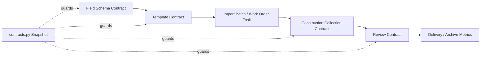

# PM Platform Backend Contract Review - 2026-07-02

## Baseline

- Production branch: `production/V3/3.0.71`
- Feature branch: `pm-platform/project-drafts`
- Contract snapshot module: `v2-api/app/services/platform/contracts.py`
- Verification script: `scripts/verify_platform_backend_contract_snapshot.py`

## Purpose

This review freezes the current shared backend contract names before the platform widens persistence or splits more backend development lanes.

The snapshot is read-only. It does not change routes, database schema, import execution, construction submission, review actions, uploads, OSS, PostgreSQL, tags, releases, or production version numbers.

## Contract Map



## Frozen Names

- Template types: `initial_work_orders`, `external_completed`
- Field sources: `import`, `field_collection`, `review`, `system`
- Required construction schema keys: `primary_field`, `aggregate_field`, `construction_fields`, `photo_slots`
- Review status count keys: `pending_review`, `approved`, `returned`, `exception`, `not_ready`
- Review actions: `approved`, `returned`, `exception`
- Required KPI keys include: `installer`, `completed_at`, `uploaded_at`, `photo_count`, `old_device_recovered`

## Team Usage

- Backend Field Schema Agent uses the field source, capture method, and data type names.
- Backend Import And Template Agent uses the template type and handoff names.
- Backend Construction And Review Agent uses construction payload, KPI, and review status names.
- Frontend agents consume these names through `v2-web/src/api/types.ts` and `v2-web/src/api/services.ts`.
- QA And Verification Agent runs the snapshot script before PR or patch handoff.

## Verification

```powershell
.\.venv\Scripts\python.exe -m pytest v2-api/tests/test_platform_contracts.py -q
.\.venv\Scripts\python.exe .\scripts\verify_platform_backend_contract_snapshot.py
```

Expected:

```text
1 passed
[OK] platform backend contract snapshot is consistent
```

## Migration Notes

- No database migration.
- No API route behavior change.
- No import/export behavior change.
- No production data change.

## Rollback Notes

- Remove `v2-api/app/services/platform/contracts.py`.
- Remove `v2-api/tests/test_platform_contracts.py`.
- Remove `scripts/verify_platform_backend_contract_snapshot.py`.
- Remove this report and revert the team memory entry.
