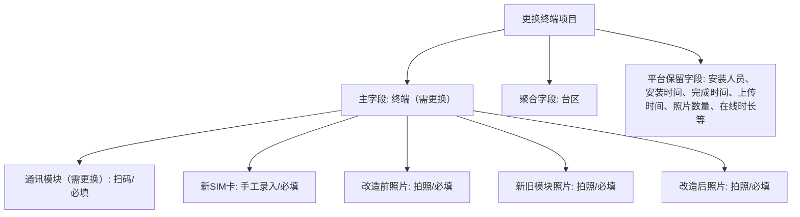
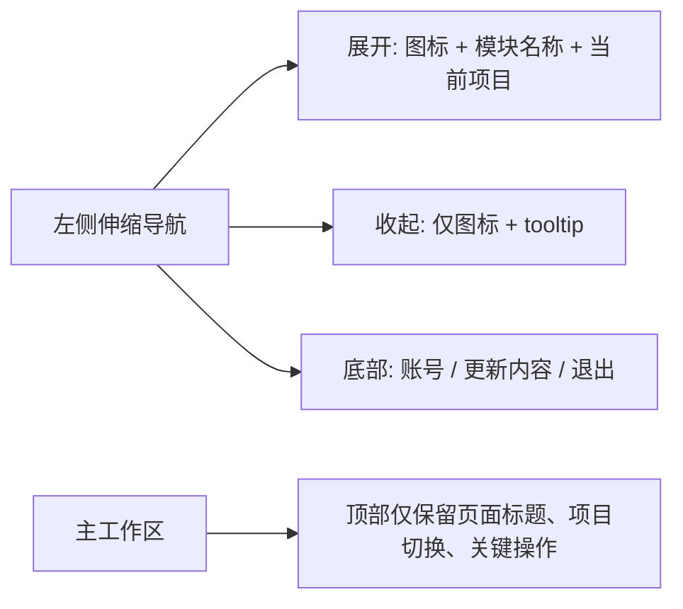

# 运维工程管理平台全流程测试与多角色评估报告

测试日期：2026-06-30  
测试环境：本机开发环境，`http://127.0.0.1:52131`  
测试项目：`更换终端`，项目 ID `draft-project-3`  
生产基线：V3.0.70 页面壳，平台开发分支本地环境

## 结论

当前平台已经具备“多项目管理平台”的第一层闭环：可以创建项目草稿，配置项目独有字段，按项目读取驾驶舱、施工、审阅、任务领取等模块，并按配置下载接入模板。

本次冒烟测试结果：15 项 API/入口检查全部通过；浏览器层验证通过项目列表、字段配置弹窗、主要页面入口加载；左侧可伸缩导航已实现并通过构建与浏览器 DOM 验证。  
限制：本轮没有真实施工照片、真实导入表和真实审阅资料组，因此只能证明平台配置、入口、模板和空数据状态闭环，不等于已完成真实项目交付压测。

## 测试证据

API 冒烟覆盖：

| 测试项 | 结果 | 证据 |
| --- | --- | --- |
| 服务健康检查 | 通过 | `/health` 返回 200 |
| 项目列表 | 通过 | `/projects` 返回 5 个项目，包含 `更换终端` |
| 字段配置 | 通过 | 主字段 `终端（需更换）`，聚合字段 `台区` |
| 初始接入模板 | 通过 | 表头含 `终端（需更换）`、`台区` |
| 系统外已完成模板 | 通过 | 表头含终端、台区、通讯模块、新 SIM 卡、三类照片 |
| 施工采集模板隐藏 | 通过 | `/templates/field_collection` 返回 404 |
| 模块接口 | 通过 | progress / delivery / field / review 均返回 200 |
| 页面入口 | 通过 | 项目管理、驾驶舱、施工、审阅、任务领取均返回页面 |

浏览器验证：

- 项目管理页异步加载后显示 `更换终端`。
- `更换终端` 行显示 `字段配置 / 模板下载 / 进入模块`。
- 字段配置弹窗中可读到：
  - `终端（需更换）`
  - `通讯模块（需更换）`
  - `新SIM卡`
  - `改造前照片`
  - `新旧模块照片`
  - `改造后照片`
- 驾驶舱、审阅、任务领取页面带完整平台导航壳。
- 施工页是独立施工工作台样式，能打开但弱化了平台壳。
- 左侧导航验证：
  - 旧顶部 `topbar/top-nav` 不再出现在页面 DOM 中。
  - 新页面壳包含 `.side-shell`、`.side-rail`、`.side-nav`、`.side-toggle`。
  - 展开状态为 260px 左侧栏，折叠状态为 80px 图标栏。
  - 折叠按钮可切换 DOM 状态；持久化逻辑由源码验证脚本覆盖。
  - 构建通过，移动端响应式规则由 `@media (max-width: 900px)` 覆盖。

## 当前更换终端字段模型

## 多角色评估

### 公司老板

关注点：是否能管多个项目、看整体进度、看交付风险。

当前价值：

- 已经不再局限于单一“更换模块项目”，可以配置 `更换终端` 这样的新项目草稿。
- 项目列表提供进度、交付能力、现场采集、审阅、任务中心、风险的统一入口。
- 系统外已完成模板能支持半路接入项目，有利于把已在外部运行的项目纳入平台。

主要不足：

- 当前数据为空，老板视角还缺少真实汇总指标和跨项目排行。
- 还没有“公司级总览”：按项目、班组、安装人员、异常类型聚合的经营看板仍需建设。

建议：

- 下一阶段优先做公司级总览：项目进度排行、交付风险榜、人员效率榜、异常闭环率。

### 项目经理

关注点：项目如何新建、字段如何落地、模板如何导入、进度如何跟踪。

当前价值：

- 项目字段已经可以按项目配置，主字段和聚合字段有常用下拉。
- 模板入口已经收敛为两类：初始接入、系统外已完成，定位清楚。
- `更换终端` 项目的主对象、现场采集项和照片项已经配置完成。

主要不足：

- 项目字段配置仍偏技术化，字段编码、来源、采集方式需要项目经理理解。
- 草稿项目到正式项目的启用/锁定/变更评审流程还不完整。
- 没有模板预览和导入前校验报告。

建议：

- 增加“项目配置向导”：选择项目类型、主字段、聚合字段、现场必采项、照片规则、KPI 规则。
- 增加“模板下载后导入校验”：缺字段、重复主字段、格式错误、照片缺失规则提前提示。

### 施工员

关注点：现场能不能少录、少错、快速知道要拍什么。

当前价值：

- `更换终端` 已明确现场要采集通讯模块、新 SIM 卡和三类照片。
- 施工采集页可打开，并能作为独立工作台使用。
- 字段模型已经区分扫码、手工录入、拍照。

主要不足：

- 当前施工页还没有展示“更换终端”专属字段表单的真实任务样例。
- 新 SIM 卡手工录入容易输错，建议后续支持扫码/拍照 OCR 作为辅助。
- 三类照片需要在现场页面以步骤式清单展示，否则施工员仍可能漏拍。

建议：

- 施工页改为“任务步骤卡”：先确认终端，再扫通讯模块，再录 SIM 卡，再拍 3 类照片，最后提交。
- 对照片项显示示例图或拍摄要求，减少返工。

### 审阅员

关注点：资料是否完整、照片是否合格、异常如何退回。

当前价值：

- 审阅工作台能按项目进入。
- 字段模型已经把照片类型区分开，为后续审阅规则提供基础。

主要不足：

- 当前没有真实资料组，无法验证“按更换终端字段审阅”的完整闭环。
- 审阅页目前更多围绕既有模块项目资料，项目字段驱动的审阅表单还需要继续打通。

建议：

- 审阅页按项目字段生成检查项：通讯模块是否采集、新 SIM 卡是否录入、三类照片是否齐全。
- 增加一键退回原因：缺改造前照片、缺新旧模块照片、SIM 卡不清晰等。

### 数据/系统管理员

关注点：模板、权限、数据安全、版本跟随生产线。

当前价值：

- 模板由项目 schema 生成，减少人工维护 Excel 的不一致。
- 现场采集模板不再暴露，避免把施工流程和中途接入模板混淆。
- 本次测试未触碰生产 `.env`、上传目录、生产 OSS 或 PostgreSQL。

主要不足：

- 本地服务启动依赖环境变量，若未设置 `STATE_BACKEND=json` 和草稿路径，容易出现空数据或等待数据库。
- 草稿项目数据属于本地开发数据，需要避免误纳入提交。

建议：

- 增加一个标准本地启动脚本，固定开发环境变量。
- 增加“项目配置导出/导入 JSON”，让配置迁移可审计、可回滚。

## 导航栏评估：已改为左侧伸缩导航

原结构问题：

- `v2-web/src/layouts/AppLayout.vue` 使用顶部 `header.topbar` 和 `nav.top-nav`。
- 顶部横向导航在模块增多后会拥挤，且页面标题、项目名、角色信息也挤在同一行。

已落地方案：

改造收益：

- 平台模块会越来越多，左侧导航比顶部导航更适合工程管理平台。
- 老板/项目经理可快速切项目和模块。
- 审阅员/施工员可以减少顶部视觉干扰。
- 后续新增“项目配置、导入中心、报表中心、权限中心”不必继续挤顶部。

已完成：

1. 把现有顶部 nav 迁移到左侧，可折叠，保持现有路由不变。
2. 顶部改为轻量标题栏，显示当前页面和当前项目。
3. 左侧底部保留更新内容、角色信息和退出登录。
4. 增加移动端响应式布局，窄屏时侧栏转为顶部紧凑横向导航。

仍需继续优化：

1. 增加项目切换器，避免用户只能通过项目列表切换上下文。
2. 施工页增加“返回平台/沉浸施工”切换，避免施工员迷路。
3. 对收起状态增加更明确的 tooltip 视觉反馈。

## 风险清单

| 风险 | 影响 | 建议优先级 |
| --- | --- | --- |
| 真实导入/施工/审阅数据尚未闭环验证 | 无法证明生产现场可直接使用 | P0 |
| 字段配置仍偏技术化 | 项目经理配置门槛高 | P0 |
| 施工页未完全按项目 schema 动态渲染真实任务 | 多项目扩展会卡在现场采集 | P0 |
| 顶部导航扩展性不足 | 模块增多后可用性下降 | P1 |
| 本地启动环境变量易错 | 测试结论可能被环境干扰 | P1 |
| 草稿转正式项目流程缺失 | 配置变更不可控 | P1 |

## 下一阶段建议

优先级建议：

1. 打通“更换终端”的真实样例任务：导入 3-5 条终端工单，生成现场施工任务。
2. 施工页按项目字段动态展示：通讯模块扫码、新 SIM 卡录入、三类照片上传。
3. 审阅页按项目字段动态检查完整性。
4. 做项目配置向导和模板导入校验报告。
5. 做真实样例数据回放报告：每条工单从导入到归档都有可追踪记录。

## 本轮结论

平台方向是成立的：项目字段模型、模板中心、项目列表和模块入口已经能支撑“多项目运维工程管理平台”的骨架。

但离“可让老板看经营、项目经理管交付、施工员按步骤施工、审阅员按规则审阅”的完整产品，还有三条关键链路需要继续打通：

1. 项目配置向导化。
2. 现场施工页 schema 驱动化。
3. 审阅规则 schema 驱动化。
