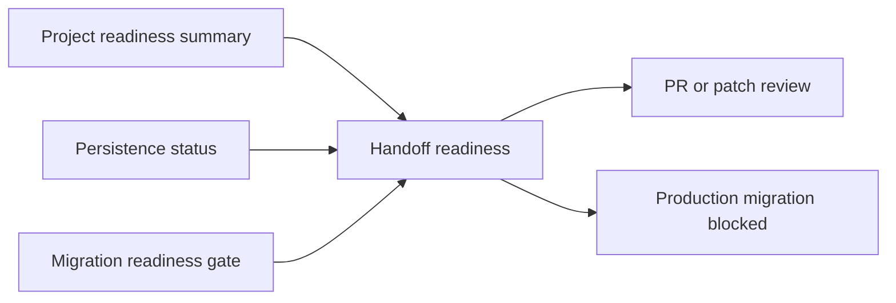

# PM Platform Handoff Readiness Summary Report

Date: 2026-07-02

## Scope

Platform Handoff Readiness Summary adds a read-only review entry for the platform branch. It summarizes the production baseline, project onboarding readiness, local persistence status, migration gate state, and production safety blockers without creating a release, tag, migration, PostgreSQL write path, or production deployment.

## Changed Behavior

- Backend adds `GET /projects/handoff/readiness`.
- The endpoint returns:
  - `handoff_version: 1`,
  - `feature_branch: pm-platform/project-drafts`,
  - `production_baseline: production/V3/3.0.71 / V3.0.71`,
  - `ready_for_review_package: true`,
  - `ready_for_production_migration: false`,
  - `ready_for_production_release: false`,
  - nested project readiness summary, persistence status, and migration gate payloads.
- Frontend adds a top-level `/platform-projects` `交付就绪` band before the existing `上线检查` band.
- The band shows `可评审包`, `production/V3/3.0.71`, `生产迁移未放行`, and the next review action.
- The package keeps the existing “row buttons are too many” direction: this is a summary band, not another row-level operation button.

## Verification

Fresh verification on 2026-07-02:

- `.\.venv\Scripts\python.exe -m pytest v2-api\tests\test_platform_handoff_readiness.py -q`
  - RED before implementation: `404 Not Found`.
- `.\.venv\Scripts\python.exe -m pytest v2-api\tests\test_platform_handoff_readiness.py v2-api\tests\test_platform_migration_readiness.py v2-api\tests\test_platform_persistence_status.py v2-api\tests\test_platform_project_readiness.py -q`
  - GREEN after implementation: `6 passed, 1 warning`.
- `.\.venv\Scripts\python.exe scripts\verify_platform_handoff_readiness.py`
  - Result: `[OK] platform handoff readiness summary is consistent`.
- `node scripts\verify_vue_platform_handoff_readiness.js`
  - RED before frontend wiring: missing `PlatformHandoffReadiness`.
  - GREEN after frontend wiring: `[OK] Vue platform handoff readiness is wired.`
- `pnpm --dir v2-web build` with bundled Node/Pnpm on PATH
  - Result: exit code 0, `1894 modules transformed`, built in `9.65s`.
  - Existing warnings only: Rollup PURE annotation warning and chunk-size warning.
- Browser smoke: `http://127.0.0.1:52131/platform-projects`
  - `.handoff-readiness-band` exists before `.readiness-summary-band`.
  - Visible text: `交付就绪`, `可评审包`, `production/V3/3.0.71`, `生产迁移未放行`, `准备 PR 或 patch 交付`.

## Migration And Rollback

- No Alembic migration.
- No PostgreSQL schema change.
- No PostgreSQL connection or write path.
- No production `.env`, data, uploads, OSS object, PostgreSQL data, version tag, or deployment change.
- Rollback: remove `v2-api/app/services/platform/handoff_readiness.py`, remove the `/projects/handoff/readiness` route, remove `v2-api/tests/test_platform_handoff_readiness.py`, remove `scripts/verify_platform_handoff_readiness.py`, revert frontend type/service/view changes, remove `scripts/verify_vue_platform_handoff_readiness.js`, revert this report, and rebuild Vue static assets from the same feature branch.

## Risks

- This is an aggregation and review surface. It does not mean production release or PostgreSQL migration is approved.
- `ready_for_review_package` means the branch has a reviewable handoff summary; `ready_for_production_migration` and `ready_for_production_release` intentionally remain false.
- Generated Vue static assets changed after the frontend build and should be reviewed as build output.
