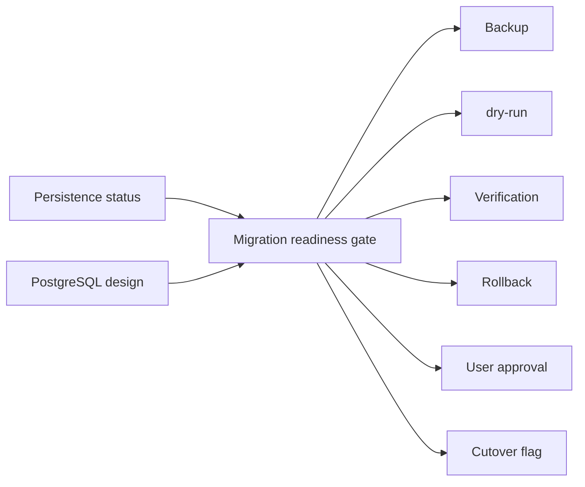

# PM Platform Migration Readiness Gate Report

Date: 2026-07-02

## Scope

Platform Migration Readiness Gate adds a read-only gate for the future PostgreSQL project configuration migration. It makes the required backup, dry-run, verification, rollback, approval, and cutover-flag conditions visible before any high-risk migration work can proceed.

## Changed Behavior

- Backend adds `GET /projects/persistence/migration-readiness`.
- The endpoint returns `ready_for_migration: false`, `requires_user_approval: true`, and `creates_migration: false`.
- The gate lists blocked required items for:
  - backup,
  - dry-run,
  - verification,
  - rollback,
  - approval,
  - cutover flag.
- The existing `字段配置` -> `持久化准备` panel now shows a `迁移门禁` list with the blocked approval gates.
- Gate copy is Chinese-facing for operators while preserving technical tokens such as `dry-run`, `PostgreSQL`, and fallback names where useful.

## Verification

Fresh verification on 2026-07-02:

- `.\.venv\Scripts\python.exe -m pytest v2-api\tests\test_platform_migration_readiness.py -q`
  - RED before implementation: route returned `404 Not Found`.
  - GREEN after implementation: `1 passed, 1 warning`.
- `.\.venv\Scripts\python.exe scripts\verify_platform_migration_readiness.py`
  - Result: `[OK] platform migration readiness gate is consistent`.
- `node scripts\verify_vue_project_persistence_readiness.js`
  - RED before frontend wiring: missing `PlatformMigrationGateItem`.
  - GREEN after frontend wiring: `[OK] Vue project persistence readiness is wired.`
- `pnpm --dir v2-web build` with bundled Node/Pnpm on PATH
  - Result: exit code 0, `1894 modules transformed`, built in `8.85s`.
- Browser smoke: `http://127.0.0.1:52131/platform-projects`
  - 193 project rows visible.
  - First row `字段配置` button opened the dialog.
  - `持久化准备` and `迁移门禁` were visible.
  - Backup, dry-run, rollback, approval, and `待审批` gate items were visible.
  - `刷新准备状态` kept the gate populated.

## Migration And Rollback

- No Alembic migration.
- No PostgreSQL schema change.
- No PostgreSQL connection.
- No production `.env`, data, uploads, OSS object, PostgreSQL data, version tag, or deployment change.
- Rollback: remove `v2-api/app/services/platform/migration_readiness.py`, remove the route, remove `v2-api/tests/test_platform_migration_readiness.py`, remove `scripts/verify_platform_migration_readiness.py`, revert frontend type/service/view changes, revert `scripts/verify_vue_project_persistence_readiness.js`, this report, and regenerated Vue static assets from the same feature branch.

## Risks

- The gate intentionally blocks migration; it is a readiness and approval surface, not a migration executor.
- Real migration still requires explicit user approval, backups, dry-run evidence, rollback rehearsal, and a separate reviewed Alembic package.
- Generated Vue static assets changed after the frontend build and should be reviewed as build output.
