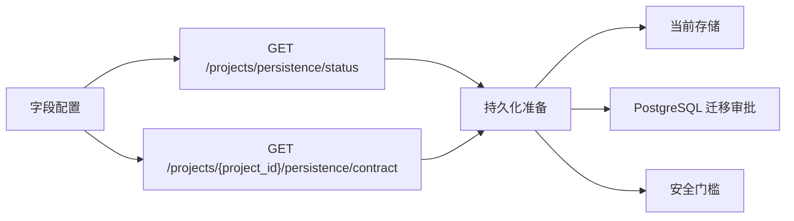

# PM Platform Persistence Readiness Frontend Report

Date: 2026-07-02

## Scope

Project Persistence Readiness Frontend adds a read-only `持久化准备` panel inside the `/platform-projects` field configuration dialog. It consumes existing backend endpoints and does not execute a database migration or create a new write path.

## Changed Behavior

- Frontend types now include `PlatformPersistenceStatus` and `ProjectConfigPersistenceContract`.
- Frontend services now expose `fetchPlatformPersistenceStatus` and `fetchProjectConfigPersistenceContract`.
- Opening `字段配置` loads persistence status and the selected project's persistence contract.
- The dialog shows:
  - current storage backend,
  - database state,
  - PostgreSQL migration approval state,
  - target tables,
  - round-trip preservation status,
  - safety gates.
- The panel has a refresh button and stays inside the existing configuration dialog instead of adding row-level operation buttons.

## Verification

Fresh verification on 2026-07-02:

- `node scripts\verify_vue_project_persistence_readiness.js`
  - Result: `[OK] Vue project persistence readiness is wired.`
- `pnpm --dir v2-web build` with bundled Node/Pnpm on PATH
  - Result: exit code 0, `1894 modules transformed`, built in `8.57s`.
  - Notes: existing Rollup PURE annotation warnings and large chunk warnings remain non-blocking.
- Browser smoke: `http://127.0.0.1:52131/platform-projects`
  - 193 project rows visible.
  - First row `字段配置` button was unique and opened the dialog.
  - `持久化准备`, `当前存储`, `PostgreSQL`, `迁移审批`, `目标表`, and `安全门槛` were visible.
  - `刷新准备状态` button was unique; clicking it kept the panel visible and populated.

## Migration And Rollback

- No database migration.
- No PostgreSQL schema change.
- No production `.env`, data, uploads, OSS object, PostgreSQL data, version tag, or deployment change.
- Rollback: revert `v2-web/src/api/types.ts`, `v2-web/src/api/services.ts`, `v2-web/src/views/ProjectsView.vue`, `scripts/verify_vue_project_persistence_readiness.js`, this report, and regenerated Vue static assets from the same feature branch.

## Risks

- The panel is read-only and depends on the existing backend persistence endpoints being available.
- It makes migration readiness visible but intentionally does not approve, run, or simulate an Alembic migration.
- Generated Vue static assets changed after the frontend build and should be reviewed as build output.
