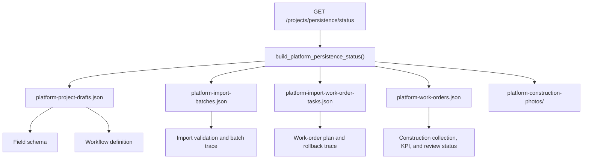

# PM Platform Persistence Status - 2026-07-02

## Baseline

- Production branch: `production/V3/3.0.71`
- Feature branch: `pm-platform/project-drafts`
- Status route: `GET /projects/persistence/status`
- Status service: `v2-api/app/services/platform/persistence.py`
- Verification script: `scripts/verify_platform_persistence_status.py`

## Purpose

This package makes the current platform persistence mode visible and testable before the project moves to database-backed schema/workflow persistence.

It is read-only. It does not create files, connect to PostgreSQL, write data, mutate OSS, change uploads, add a migration, bump a version, create a tag, or publish to a server.

## Persistence Map



## What The Status Reports

- `state_backend`: the configured state backend, reported as-is.
- `database.url_redacted`: configured database URL with password removed.
- `database.used_for_platform_project_config`: currently `false`; project configuration still uses local JSON storage.
- `stores`: project drafts, import batches, work-order tasks, platform work orders, and construction photo storage.
- `guarantees`: field schema and workflow definitions are persistent for draft projects; import/work-order operations remain rollback traceable.
- `safety`: status-only, database URL redacted, no OSS mutation, no PostgreSQL schema change, no production data edit.

## Operator Meaning

For the current platform development branch:

- New project field schemas and workflow definitions are durable through the local project draft JSON store.
- Template import batches, work-order creation plans, platform construction work orders, and review state are also represented by local JSON/file stores.
- PostgreSQL remains the configured state backend for existing production state, but the PM platform configuration has not yet been migrated into PostgreSQL.
- A future PostgreSQL persistence package needs a separate schema migration, backup, verification, and rollback plan.

## Verification

```powershell
.\.venv\Scripts\python.exe -m pytest v2-api/tests/test_platform_persistence_status.py -q
.\.venv\Scripts\python.exe .\scripts\verify_platform_persistence_status.py
.\.venv\Scripts\python.exe -m pytest v2-api/tests/test_platform_overview.py::test_project_draft_work_item_schema_can_be_updated_and_persisted -q
.\.venv\Scripts\python.exe -m pytest v2-api/tests/test_platform_overview.py::test_project_draft_registry_recovers_projects_after_memory_reset -q
```

Expected:

```text
All focused checks exit 0.
```

## Migration Notes

- No database migration.
- No production data write.
- No write-path behavior change.
- This only exposes the current persistence status.

## Rollback Notes

- Remove `v2-api/app/services/platform/persistence.py`.
- Remove the `/projects/persistence/status` route from `v2-api/app/api/routes/projects.py`.
- Remove `v2-api/tests/test_platform_persistence_status.py`.
- Remove `scripts/verify_platform_persistence_status.py`.
- Remove this report and revert the team memory entry.
