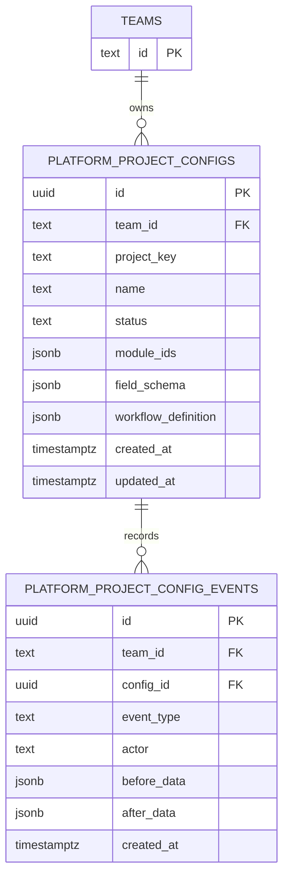

# PM Platform PostgreSQL Persistence Design - 2026-07-02

## Baseline

- Production branch: `production/V3/3.0.71`
- Feature branch: `pm-platform/project-drafts`
- Design module: `v2-api/app/services/platform/postgres_design.py`
- Verification script: `scripts/verify_platform_postgres_design.py`

## Purpose

This package designs the first PostgreSQL-backed persistence slice for PM platform configuration. It does not create or run an Alembic migration.

The current platform can already keep draft project field schemas and workflow definitions in local JSON. The next durable slice should move that configuration into PostgreSQL while keeping JSON fallback available during rollout.

## Table Sketch



## Index Plan

- `uq_platform_project_configs_team_project_key`: unique `team_id, project_key`
- `ix_platform_project_configs_team_status`: `team_id, status`
- `ix_platform_project_configs_updated_at`: `updated_at`
- `ix_platform_project_config_events_config_created`: `config_id, created_at`
- `ix_platform_project_config_events_team_created`: `team_id, created_at`

These follow current project conventions: tenant/team scoping, indexed foreign keys, indexed common filters, `JSONB` for variable configuration payloads, and `timestamptz` for timestamps.

## Migration Plan

1. Backup production database and current local JSON stores.
2. Dry-run the Alembic migration against a restored copy or staging database.
3. Create new tables and indexes without changing read paths.
4. Backfill `platform_project_configs` from `platform-project-drafts.json`.
5. Verify project counts, project keys, field schema JSON, and workflow definition JSON.
6. Cut over reads behind an explicit feature flag after user approval.

## Rollback Plan

1. Disable PostgreSQL reads and force JSON fallback.
2. Keep JSON fallback files unchanged until production acceptance completes.
3. Export `platform_project_configs` and `platform_project_config_events` before rollback.
4. Backup before dropping new tables.
5. Drop new tables only after explicit user approval.

## Requires User Approval

- Creating the Alembic migration file.
- Running migration commands against any shared or production database.
- Backfilling existing platform project configuration into PostgreSQL.
- Cutting read/write paths from JSON fallback to PostgreSQL.
- Dropping new PostgreSQL tables during rollback.

## Verification

```powershell
.\.venv\Scripts\python.exe -m pytest v2-api/tests/test_platform_postgres_design.py -q
.\.venv\Scripts\python.exe .\scripts\verify_platform_postgres_design.py
```

Expected:

```text
1 passed
[OK] platform postgres persistence design is consistent
```

## Migration Notes

- No database migration in this package.
- No production data write.
- No `APP_VERSION` change.
- No tag or production release.

## Rollback Notes

- Remove `v2-api/app/services/platform/postgres_design.py`.
- Remove `v2-api/tests/test_platform_postgres_design.py`.
- Remove `scripts/verify_platform_postgres_design.py`.
- Remove this report and revert the team memory entry.
