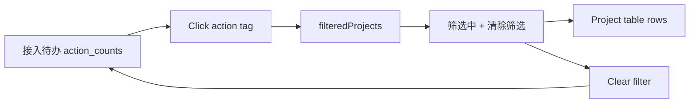

# PM Platform Readiness Action Filter Report

Date: 2026-07-02

## Scope

This package makes the `/platform-projects` `接入待办` summary actionable. Operators can click one readiness action count and the project list immediately filters to projects that still need that action. The filter is read-only and uses the existing readiness summary data.

Package name: Project Readiness Action Filter.

## Changed Behavior

- `ProjectsView.vue` now keeps a local `selectedReadinessAction`.
- The project table uses `filteredProjects` instead of the raw project list.
- `接入待办` tags call `applyReadinessActionFilter(item.action)`.
- The clear command calls `clearReadinessActionFilter`.
- A visible filter state shows `筛选中`, the selected action count, and a `清除筛选` command.
- The selected action is cleared automatically if the latest readiness summary no longer contains that action.

## Verification

Fresh verification on 2026-07-02:

- `node scripts\verify_vue_project_readiness_summary_list.js`
  - Result: `[OK] Project readiness summary list is wired to the frontend.`
- `pnpm --dir v2-web build` with bundled Node/Pnpm on PATH
  - Result: exit code 0, `1894 modules transformed`, built in `10.24s`.
  - Notes: existing Rollup PURE annotation warnings and large chunk warnings remain non-blocking.
- Browser smoke: `http://127.0.0.1:52131/platform-projects`
  - Before click: 4 `接入待办` tags visible, 193 table rows.
  - Clicked `启用现场、审阅、工单和交付模块 154 个`.
  - After click: `筛选中` and `清除筛选` visible, table rows filtered to 154, selected tag rendered as dark.
  - After clear: filter state hidden and table rows returned to 193.

## Migration And Rollback

- No database migration.
- No permission, import/export, or production business-rule migration.
- No production `.env`, data, uploads, OSS object, PostgreSQL data, version tag, or deployment change.
- Rollback: revert `v2-web/src/views/ProjectsView.vue`, `scripts/verify_vue_project_readiness_summary_list.js`, this report, and regenerated Vue static assets from the same feature branch.

## Risks

- This is a frontend-only filter, so it depends on the existing `GET /projects/readiness/summary` payload being current.
- The row count in browser smoke uses local demo data; production counts will depend on real project readiness data.
- Generated Vue static assets changed after the frontend build and should be reviewed as build output.
