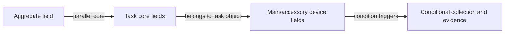

# Field Graph Relationship Lines Plan

Date: 2026-07-03
Branch: `pm-platform/production-3.0.77-sync`
Baseline: `production/V3/3.0.77` / `V3.0.77`

## Objective

Make the graphical field designer explain device hierarchy with visible relationship lines, not only grouped cards.

The user rule is:

- Aggregate field is the first layer and only one is active at a time.
- Terminal number and terminal address are parallel task-core fields.
- Device replacement fields belong under the task object.
- Accessory follow-up fields and photos are driven by replacement-confirmation conditions.

## Visual Rule

## Scope

- Add a focused frontend guard for visible relationship-line semantics.
- Add labels to existing SVG connectors in `FieldGraphDesigner.vue`.
- Add a legend explaining parallel core fields, task-object ownership, and conditional triggers.
- Add a relationship summary under the graph for core peers, main-device replacement, accessory confirmation, and conditional collection counts.
- Keep drag/drop parent reassignment, field details, template preview, and conditional required configuration unchanged.

## Data Safety

- Frontend-only field configuration visualization package.
- No production `.env`, data, uploads, OSS object, PostgreSQL row, version number, tag, or deployment path is touched.
- No template, import, construction, review, or persistence business rule is changed.

## Verification Plan

- `node scripts\verify_vue_field_graph_relationship_lines.js`
- `node scripts\verify_vue_project_field_graph_designer.js`
- `node scripts\verify_vue_device_hierarchy_config.js`
- `node scripts\verify_vue_field_graph_conditional_required_config.js`
- `node scripts\verify_vue_work_item_schema_config.js`
- `pnpm --dir v2-web build`
- Browser smoke: `/platform-projects`, open `更换终端` field config and confirm line labels, legend, and summary are visible.

## Rollback

- Revert `v2-web/src/components/project-fields/FieldGraphDesigner.vue`.
- Revert `scripts/verify_vue_field_graph_relationship_lines.js`.
- Rebuild Vue static assets from reverted source if generated assets are included.
- No production rollback is needed because no production deployment, migration, tag, version bump, OSS write, or PostgreSQL write is performed.
