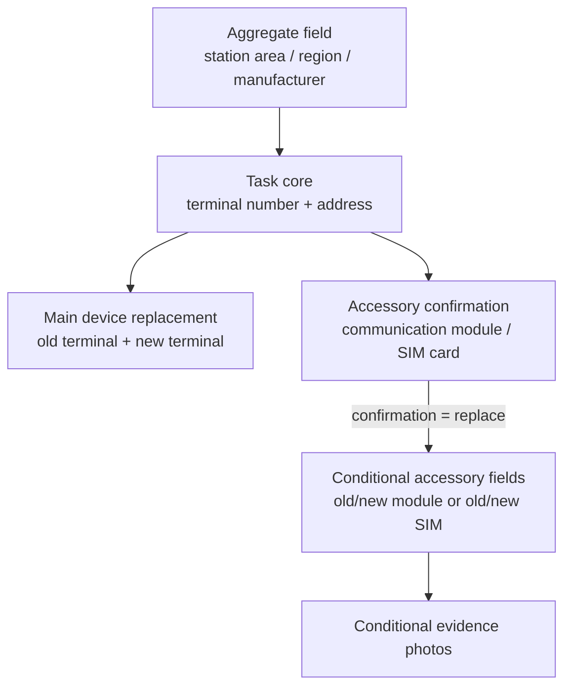

# Review Conditional Visibility Plan

Date: 2026-07-03
Branch: `pm-platform/production-3.0.77-sync`
Baseline: `production/V3/3.0.77` / `V3.0.77`

## Objective

Make platform review panels respect the same device hierarchy and conditional accessory rules already used by construction previews.

Module replacement is an accessory-device replacement under one task object. Terminal replacement is a main-device replacement under the terminal task object, and its accessory fields only expand when the corresponding replacement confirmation says they apply.

## Visual Rule

## Scope

- Strengthen the review hierarchy guard script first and observe it fail.
- In `ReviewView.vue`, derive active field reviews and photo slot reviews from the selected work order's actual values.
- In `TaskHallView.vue`, apply the same active conditional filtering for the real platform review workbench.
- Keep the existing review section labels and grouping; only remove inactive conditional accessory rows from each selected work order.

## Data Safety

- This is a frontend review visibility package plus guard-script documentation.
- No production `.env`, data, uploads, OSS object, PostgreSQL row, version number, tag, or deployment path is touched.
- No import, construction submission, approval, or persistence semantics are changed.

## Verification Plan

- `node scripts\verify_vue_review_hierarchy_sections.js`
- `node scripts\verify_vue_construction_conditional_visibility.js`
- `node scripts\verify_vue_construction_hierarchy_collection.js`
- `python scripts\verify_platform_terminal_review_sample.py`
- `pnpm --dir v2-web build`
- Browser smoke: `/task-hall?project_id=draft-project`, compare `TT-TERM-REVIEW-001` and `TT-TERM-REVIEW-002`.

## Rollback

- Revert `v2-web/src/views/ReviewView.vue`.
- Revert `v2-web/src/views/TaskHallView.vue`.
- Revert `scripts/verify_vue_review_hierarchy_sections.js`.
- Rebuild Vue static assets from reverted source if generated assets are kept in the handoff.
- No production rollback is needed because no production deployment, migration, tag, version bump, OSS write, or PostgreSQL write is performed.
